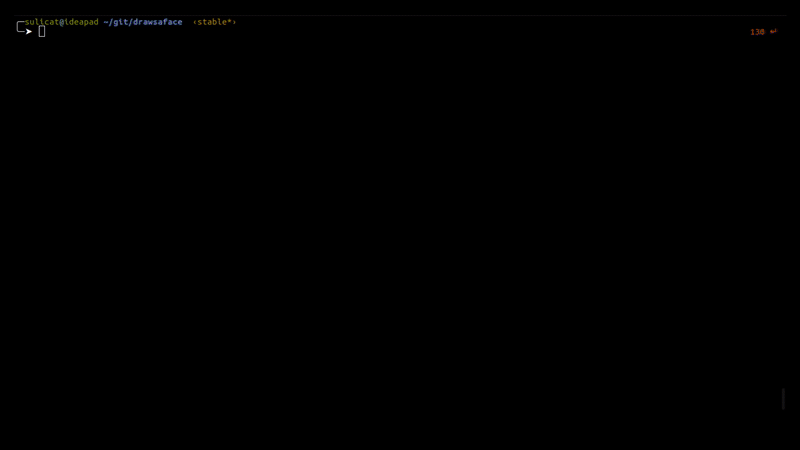

# goboi

A collection of GO utilities and libraries I sometimes use.

## Term
Immediate mode terminal gui library, an API similar to imgui but much less featured.

    import (
        "math"
        term "github.com/sulicat/goboi/term"
    )

    // Code to produce example above with the term library
	t := term.Create(50, 50)
	t.SetFullscreen(true)
	// test_float := 123.0

	is_clicked := false
	is_clicked_2 := false

	is_checked := false

	test_float := 500.123
	test_float2 := 0.000

	canvas_x := 60.0
	canvas_y := 1.0

	text_input := "hello world"

	floats := make([]float64, 10)
	offset := 0.0
	for {

		t.ResetColorscheme()

		t.ColorScheme().TextColor = term.RGB{255, 0, 0}
		t.Label("Hello  ")
		t.SameLine()
		t.ColorScheme().TextColor = term.RGB{255, 255, 0}
		t.Label("Hello wolrd")

		t.ColorScheme().TextColor = term.RGB{255, 0, 255}
		t.ColorScheme().BackgroundColor = term.RGB{0, 0, 125}
		t.Label("Hello in another line")
		t.ResetColorscheme()

		if t.Button("ClickMe") {
			is_clicked = !is_clicked
		}

		if is_clicked {
			t.SameLine()
			if t.Button("Button Clicked") {
				is_clicked_2 = !is_clicked_2
			}
		}

		if is_clicked_2 {
			t.ColorScheme().TextColor = term.RGB{255, 255, 0}
			t.Label("Edit the float inside!")
			t.InputFloat(&test_float2)
			t.ResetColorscheme()
		}

		t.CheckBox("Check me", &is_checked)
		t.InputText(&text_input, 50, 5)

		t.Space(0, 1)

		t.Label("X Y")
		t.InputFloat(&canvas_x)
		t.SameLine()
		t.InputFloat(&canvas_y)

		t.Space(0, 1)

		t.Label("Floats in a loop, no ID issues")
		for i := range 3 {
			t.InputFloat(&floats[i])
		}

		t.Space(1, 1)
		t.Label("Slider")
		t.InputFloat(&test_float)
		t.Slider(&test_float, 0, 1000)

		pixels := t.CreatePixels(int(40), int(21))
		offset += 0.005
		for i := range 360 {
			ang := float64(i) * math.Pi / 180.0
			x := math.Cos(ang) * 10
			y := math.Sin(ang) * 1 * float64(int(offset)%20-10)
			x += 10
			y += 10
			// pixels[int(x)][int(y)] = term.RGB{255, int((float64((i+int(offset))%360) / 360.0) * 255), 0}
			pixels[int(x)][int(y)] = term.RGBA{255, 255, 0, 255}
		}

		t.AbsolutePosition(int(canvas_x), int(canvas_y))
		t.Canvas(&pixels)

		t.Step()

	}